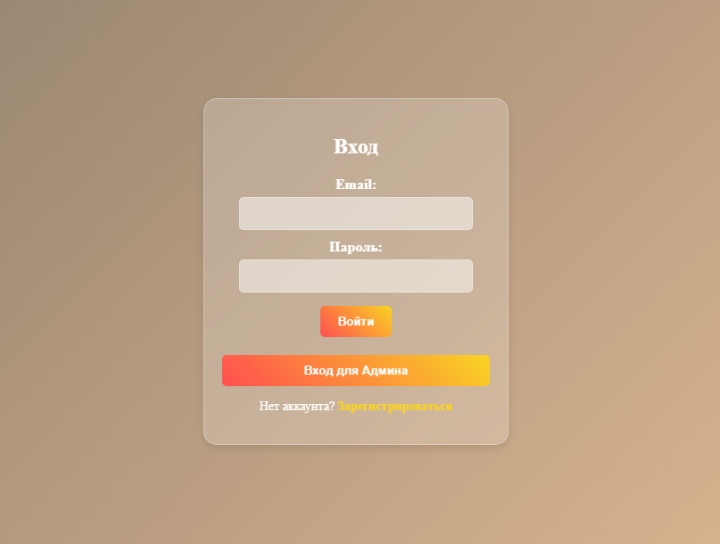
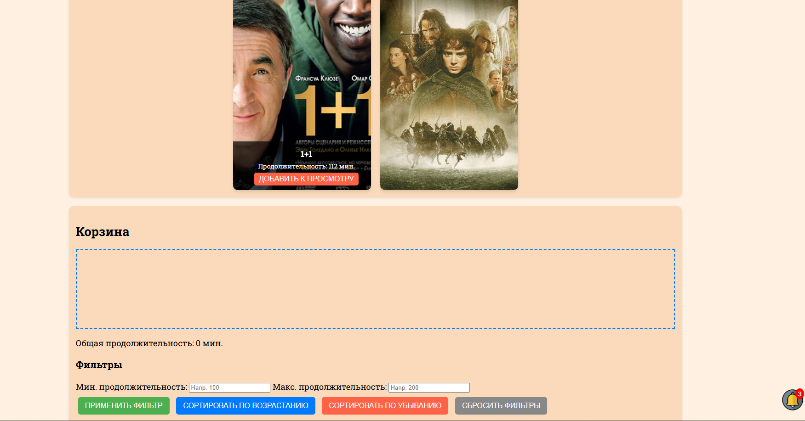
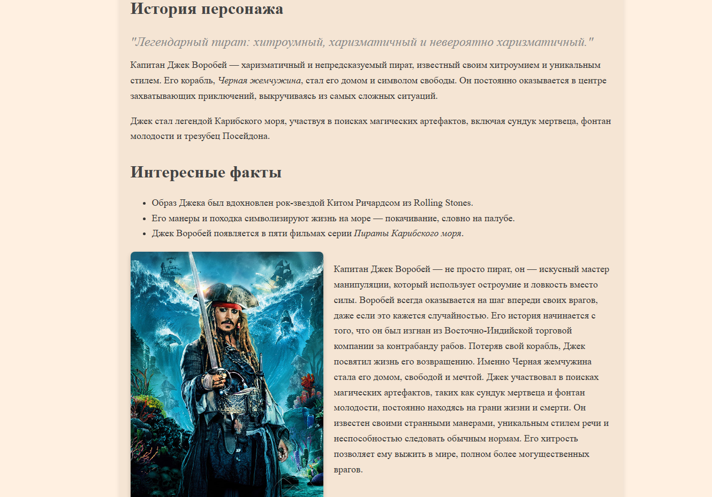

# Киногерои - Интерактивный веб-сайт о легендарных персонажах кино

Образовательный проект, посвященный культовым киногероям с использованием современных веб-технологий. Включает адаптивный дизайн, интерактивные элементы и богатый мультимедийный контент.

## Демо
[Посмотреть проект онлайн](https://artem05kz.github.io/movie_characters/main.html)

## Описание

Веб-приложение "Киногерои" предоставляет пользователям информацию о популярных персонажах кино, их истории и интересных фактах. Проект создан в рамках курсовой работы по дисциплине "Проектирование и разработка клиентских частей интернет-ресурсов".

### Основные возможности

- **Информационные разделы** о происхождении и эволюции киногероев
- **Галерея персонажей** с детальными страницами о Дарт Вейдере, Доке Эммете Брауне и Капитане Джеке Воробье
- **Топ фильмов** с интерактивной корзиной для планирования просмотра
- **Викторина** для проверки знаний о киногероях
- **Адаптивный дизайн** для всех устройств
- **Система уведомлений** для улучшения взаимодействия
- **Формы регистрации и входа** с валидацией

## Ключевые функции

### Раздел "Топ фильмов"

Интерактивная система управления фильмами:
- Добавление фильмов в корзину для просмотра
- Удаление фильмов из корзины
- Сортировка по продолжительности (по возрастанию/убыванию)
- Фильтрация по продолжительности и рейтингу
- Визуализация рейтингов с помощью звезд
- Drag & Drop функциональность
- Автоматический подсчет общей продолжительности

### Галерея киногероев

- Интерактивные миниатюры с динамическим переключением
- Страницы персонажей с параллакс-эффектом
- Подробная информация о героях
- Плавные анимации и переходы

### Викторина

- 10 вопросов о киногероях
- Визуальные элементы (изображения персонажей)
- Система оценки знаний с процентами
- Персонализированные результаты с изображениями

### Система авторизации

- Форма регистрации с CAPTCHA
- Страница входа для пользователей
- Специальный вход для администратора
- Валидация полей формы

## Технологии

### Frontend
- **HTML5** - семантическая разметка
- **CSS3** - современные стили и анимации
  - Flexbox и Grid Layout
  - Media Queries для адаптивности
  - Glassmorphism эффекты
  - Градиенты и анимации
- **JavaScript (ES6+)** - интерактивность
  - Event Listeners
  - DOM манипуляции
  - Local Storage (планируется)
  - Drag & Drop API

### Особенности реализации

- **Адаптивный дизайн** - корректное отображение на всех устройствах
- **Бургер-меню** для мобильных устройств
- **Параллакс-эффекты** на страницах персонажей
- **Система уведомлений** при прокрутке
- **Оптимизированная производительность**

## Скриншоты




## Структура проекта
```
movie_characters/
├── index.html (main.html)    # Главная страница
├── login.html                # Страница входа
├── register.html             # Страница регистрации
├── opros.html               # Викторина
├── vaider.html              # Страница Дарта Вейдера
├── dokfuture.html           # Страница Дока Брауна
├── pirate.html              # Страница Джека Воробья
├── css/
│   ├── style.css            # Главные стили
│   ├── main.css             # Стили главной страницы
│   ├── header.css           # Стили шапки
│   ├── footer.css           # Стили подвала
│   ├── cart.css             # Стили корзины
│   ├── info.css             # Стили страниц персонажей
│   ├── login.css            # Стили страницы входа
│   ├── register.css         # Стили регистрации
│   ├── opros.css            # Стили викторины
│   └── notification.css     # Стили уведомлений
├── js/
│   ├── main.js              # Основной JS
│   ├── cart.js              # Логика корзины
│   ├── info.js              # Параллакс-эффекты
│   ├── login.js             # Логика входа
│   ├── register.js          # Логика регистрации
│   ├── opros.js             # Логика викторины
│   └── notification.js      # Система уведомлений
├── img/                     # Изображения
└── README.md
```

## Установка и запуск

1. **Клонируйте репозиторий:**
```bash
git clone https://github.com/artem05kz/artem05kz.github.io.git
cd artem05kz.github.io/movie_characters
```

2. **Откройте проект:**
   - Просто откройте `main.html` в браузере
   - Или используйте Live Server в VS Code

3. **Альтернатива:**
   - Посетите [демо-версию онлайн](https://artem05kz.github.io/movie_characters/main.html)

## Совместимость

Проект протестирован и работает в следующих браузерах:
- Google Chrome (рекомендуется)
- Microsoft Edge
- Mozilla Firefox
- Safari
- Мобильные браузеры (iOS Safari, Chrome Mobile)

## Адаптивность

Сайт оптимизирован для:
- Десктопы (1920px и выше)
- Ноутбуки (1366px - 1920px)
- Планшеты (768px - 1366px)
- Мобильные устройства (320px - 768px)

## Использованные техники

### CSS
- Custom Properties (CSS Variables)
- Flexbox для сложных макетов
- Grid Layout для галерей
- Media Queries для адаптивности
- Transforms и Transitions для анимаций
- Backdrop-filter для glassmorphism
- Keyframe animations

### JavaScript
- Event Delegation
- Array Methods (filter, sort, map)
- Template Literals
- Arrow Functions
- Module Pattern

## Разделы сайта

1. **Вступление** - общая информация о киногероях
2. **Видео** - мультимедийный контент
3. **Происхождение и эволюция** - история киногероев
4. **Типы киногероев** - классификация персонажей
5. **Топ фильмов** - интерактивный список с корзиной
6. **Галерея** - персонажи с детальными страницами
7. **Термины** - словарь терминов
8. **Контакты** - форма обратной связи

## Статистика проекта

- **Страниц:** 7
- **CSS файлов:** 9
- **JS файлов:** 7
- **Изображений:** 30+
